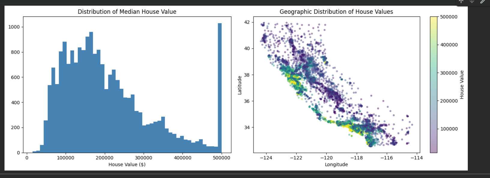
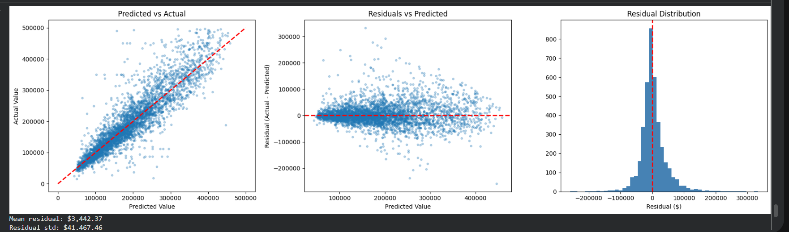
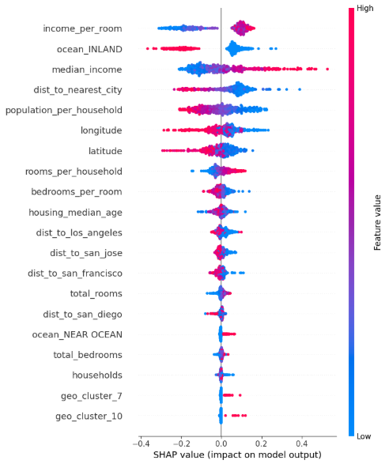

# California Housing Price Prediction

An end-to-end regression project predicting median house values across California districts, built to go well beyond the standard "clean data → one-hot encode → Random Forest" approach.

This project combines model-based imputation, geospatial feature engineering, Bayesian hyperparameter tuning, a stacking ensemble, and SHAP-based explainability into a single, leak-free pipeline.

## Dataset

[California Housing Prices](https://www.kaggle.com/datasets/camnugent/california-housing-prices) (Kaggle, sourced from the 1990 California census) — 20,640 records with 9 numeric/categorical features and a `median_house_value` target. Downloaded via the `kagglehub` library.

## Approach

1. **Data Cleaning** — removed 992 records with an artificially price-capped target (a known data-collection artifact, not a real market ceiling).
2. **Iterative Imputation** — filled missing `total_bedrooms` values using a model-based `IterativeImputer` (ExtraTreesRegressor) instead of a simple mean/median fill.
3. **Geospatial Feature Engineering** (the creative core of the project):
   - Haversine distance from each district to 4 major California cities (San Francisco, Los Angeles, San Diego, San Jose), plus distance to the nearest of the four.
   - A 15-cluster KMeans grouping on latitude/longitude to let the model learn region-specific pricing patterns.
4. **Domain Ratio Features** — rooms per household, bedrooms per room, population per household, income per room.
5. **Leak-Free Pipeline** — all scaling and encoding wrapped in a `ColumnTransformer` + `Pipeline`, so no information from the test fold leaks into training during cross-validation.
6. **Model Comparison** — Linear Regression, Ridge, Random Forest, Gradient Boosting compared via 5-fold CV.
7. **Hyperparameter Tuning** — Bayesian optimization with **Optuna** (40 trials) on a `HistGradientBoostingRegressor`, more efficient than an exhaustive grid search.
8. **Stacking Ensemble** — tested a 3-model stack (HistGradientBoosting + Random Forest + Extra Trees, RidgeCV meta-learner); reported honestly as a negative result (no improvement over the single tuned model).
9. **Explainability** — used **SHAP** to confirm which features actually drive predictions, rather than treating the model as a black box.

## Key Results

| Metric | Value |
|---|---|
| Best baseline (5-fold CV, log-RMSE) | Random Forest — 0.2180 |
| Tuned model (Optuna, log-RMSE) | HistGradientBoostingRegressor — 0.2072 |
| Stacking ensemble (log-RMSE) | 0.2071 (no meaningful gain over the single tuned model) |
| **Test RMSE** | **$41,604.84** |
| **Test MAE** | **$27,051.39** |
| **Test R²** | **0.8195** |

An R² of 0.82 means the model explains ~82% of the variance in house prices — in line with published benchmarks on this exact dataset (typically 0.80–0.84 R²).

## Screenshots

### 1. Target Distribution & Geographic Spread
Distribution of median house value (note the artificial cap at $500,000) and its geographic spread across California, colored by value.



### 2. Residual Analysis
Predicted vs. actual values, residuals vs. predicted values, and the residual distribution — confirming no systematic bias (mean residual ~$3,442, symmetric bell-shaped distribution).



### 3. SHAP Summary Plot
Feature importance and direction of impact on predicted house value. The engineered `income_per_room` feature is the strongest driver, validating the feature engineering approach.



## Tech Stack

- Python
- pandas, numpy
- scikit-learn (pipelines, imputation, ensembles, cross-validation)
- Optuna (Bayesian hyperparameter optimization)
- SHAP (model explainability)
- matplotlib

## Files

- `Housing_Price_Prediction.ipynb` — full notebook with all code, outputs, and plots

## How to Run

```bash
pip install pandas numpy scikit-learn optuna shap matplotlib kagglehub
jupyter notebook Housing_Price_Prediction.ipynb
```

Requires a Kaggle account/API token for the `kagglehub` dataset download step (`kagglehub.login()`).

## Author

**Areeba Zaka**
Machine Learning Intern
areebazaka59@gmail.com
